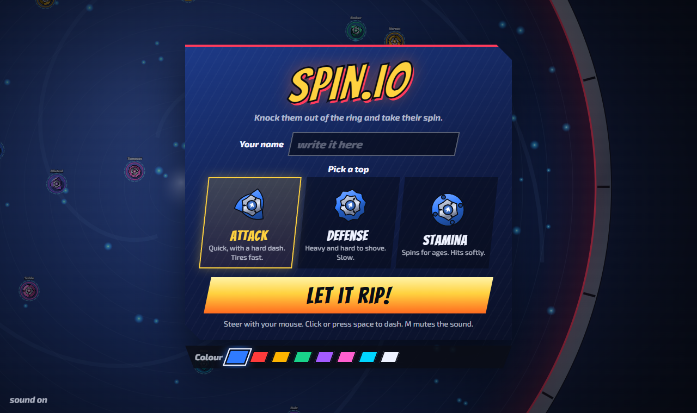
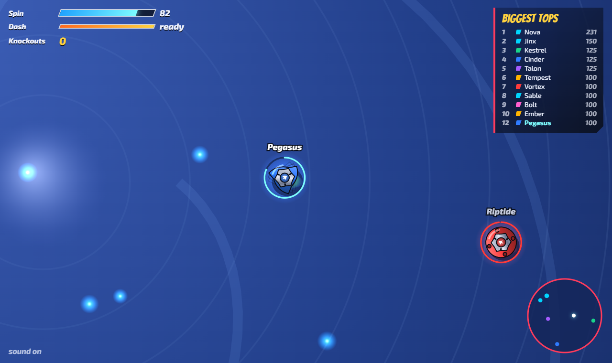
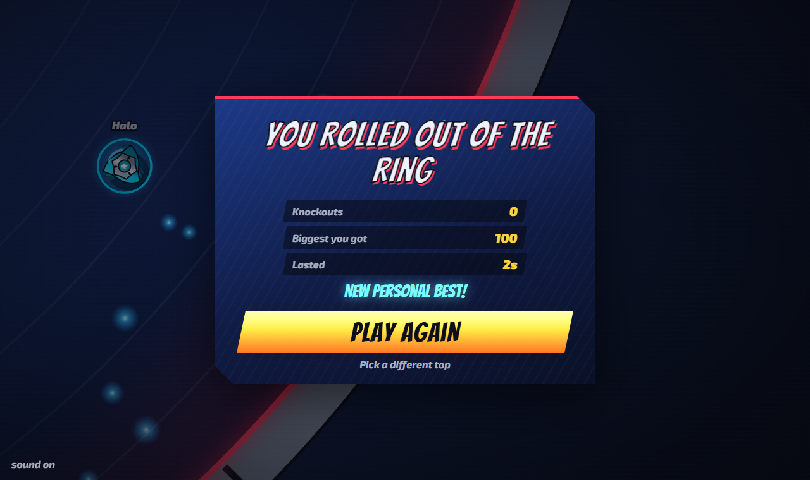

# 🌀 Spin.io

**Knock them out of the ring and take their spin.**

Spinning tops battle it out in a steel stadium. Slam into rivals, steal their spin, and grow until you're the biggest top in the arena, or wobble out of the ring trying.

### ▶️ [Play it now](https://sachinmehan3.github.io/spin.io/)



## How to play

| | |
|---|---|
| 🖱️ **Mouse** | Steer |
| 💥 **Click / Space** | Dash into someone |
| 🔇 **M** | Mute |

Pick your fighter:

- **Attack**: quick, with a hard dash. Tires fast.
- **Defense**: heavy and hard to shove. Slow.
- **Stamina**: spins for ages. Hits softly.



Your spin is your health *and* your size. Run out, or roll off the edge, and it's over. 😵



## Run it locally

```sh
npm install
npm run dev
```

`npm test` runs the simulation tests. Every push to `master` redeploys to GitHub Pages.

Let it rip! 🚀
